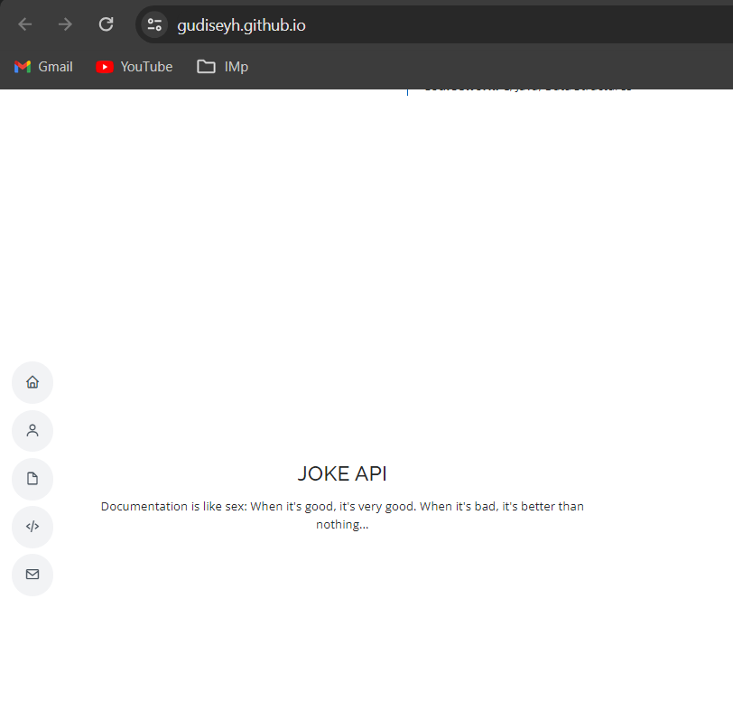

# WAPH-Web Application Programming and Hacking

## Professor: Dr. Phu Phung

## Student

**Name**: Yeshwanth Gudise

**Email**: gudiseyh@mail.uc.edu

**Short-bio**: Yeshwanth Gudise has a better understanding and passion towards programming. He wish to be as a software Engineer.

  

## Repository Information

Repository's URL: [https://github.com/rayanate/waph-rayanate.git](https://github.com/rayanate/waph-rayanate.git)

Yeshwanth Gudise can place all of the code in this private repository. This repository is structured as follows.

# Overview and Requirements

In this project, I have developed a professional website using HTML, CSS, Javascript and Bootstrap. The application has been deployed on GitHub website. Below is the URL for the portfolio website.

  Website's URL: [https://github.com/rayanate/rayanate.github.io](https://rayanate.github.io)

## General requirements:

I have successfully crafted a professional and visually appealing resume webpage using HTML5, CSS, JavaScript, and Bootstrap. The page incorporates essential details such as my name, contact information, a professional headshot, and comprehensive sections highlighting my educational background and work experiences. The use of Bootstrap ensures a responsive and well-structured design, creating a seamless and polished presentation of my resume online.

   
   
   

   

   


## Non-technical requirements

I have added bootstrap cdn in the HTML page and used bootstrap classes to style the elements on the page quickly. This has helped me achieve a clean and professional design without having to write extensive CSS code. 
Below are the CDN links for bootstrap and the icons used in the project.

```JS
  <link
    href="https://fonts.googleapis.com/css?family=Open+Sans:300,300i,400,400i,600,600i,700,700i|Raleway:300,300i,400,400i,500,500i,600,600i,700,700i|Poppins:300,300i,400,400i,500,500i,600,600i,700,700i"
    rel="stylesheet">

  <link href="assets/vendor/aos/aos.css" rel="stylesheet">
  <link href="assets/vendor/bootstrap/css/bootstrap.min.css" rel="stylesheet">
  <link href="assets/vendor/bootstrap-icons/bootstrap-icons.css" rel="stylesheet">
  <link href="assets/vendor/boxicons/css/boxicons.min.css" rel="stylesheet">
  <link href="assets/vendor/glightbox/css/glightbox.min.css" rel="stylesheet">
  <link href="assets/vendor/swiper/swiper-bundle.min.css" rel="stylesheet">
```

## Technical Requirements

### Basic Javascript code

I have used JQuery CDN in the HTML page to access the elements and performed the API calls for retrieving data from the server. This allows for dynamic updating of content without having to reload the entire page. 

Below is the JQuery CDN used in the project
```JS
<script src="https://code.jquery.com/jquery-3.7.1.min.js"
    integrity="sha256-/JqT3SQfawRcv/BIHPThkBvs0OEvtFFmqPF/lYI/Cxo=" crossorigin="anonymous"></script>
```

I have included the functionalities from Lab2 i.e. analog clock, digital clock, show/hide email, Joke API
1. Digital Clock

  ```JS
    function displayTime() {
		document.getElementById('digit-clock').innerHTML = "Current time: " + new Date();
		}
		setInterval(displayTime, 500);
  ```
   
  
2. Analog Clock
   
  ```JS
  <div class="col">
    <h3>Analog Clock</h3>
    <canvas id="analog-clock" width="150" height="150" style="background-color:#999"></canvas>
    <script src="https://waph-uc.github.io/clock.js"></script>
  	<script>
  	  function displayTime() {
  		  document.getElementById('digit-clock').innerHTML = "Current time: " + new Date();
  			}
  			setInterval(displayTime, 500);
  			var canvas = document.getElementById("analog-clock");
    		var ctx = canvas.getContext("2d");
        var radius = canvas.height / 2;
  			ctx.translate(radius, radius);
  			radius = radius * 0.90;
  			setInterval(drawClock, 1000);
        function drawClock() {
  			  drawFace(ctx, radius);
  				drawNumbers(ctx, radius);
  				drawTime(ctx, radius);
  				}
    </script>
  ```
   

    
3. Show/Hide Email
  ```JS
var shown = false;
function showhideEmail() {
    if (shown) {
        document.getElementById('email').innerHTML = "Show my email";
        shown = false;
    }
    else {
        var myemail = "<a href='mailto:rayanate" + "@" +
            "mail.uc.edu'> rayanate" + "@" + "mail.uc.edu</a>";
        document.getElementById('email').innerHTML = myemail;
        shown = true;
    }
}
```
   

   

4. Joke API

```JS
function fetchJoke() {
      $.get('https://v2.jokeapi.dev/joke/Any', function (data) {
        $('#joke-section').html(`
        <p>${data.setup || ''}</p>
        <p>${data.delivery || data.joke || ''}</p>
      `);
      }).fail(function (error) {
        console.error('Error fetching joke:', error);
      });
    }
    fetchJoke();

setInterval(fetchJoke, 60000);
```
   

5. Public API
   I have integrated Weather API to display weather and NASA API to display the image of the day.

   a. Weather API - I have included graphic i.e. image of the cloud.

      ```markdown
      async function getWeatherData(city) {
      const apiKey = '82bf333e96f9446884281940ce9c06b1';
      const apiUrl = `https://api.weatherbit.io/v2.0/current?city=${city}&key=${apiKey}`;

      try {
        const response = await fetch(apiUrl);
        const data = await response.json();

        document.getElementById('city').innerText = data.data[0].city_name;
        document.getElementById('weather-icon').src = `https://www.weatherbit.io/static/img/icons/${data.data[0].weather.icon}.png`;
        document.getElementById('temperature').innerText = `Temperature: ${data.data[0].temp}°C`;
        document.getElementById('description').innerText = `Description: ${data.data[0].weather.description}`;
      } catch (error) {
        console.error('Error fetching weather data:', error);
      }
    }

    const city = 'New York'; 
    getWeatherData(city);
    ```
   
      
    b. Random Number Facts

	```JS
            async function getRandomNumberFacts() {
      try {
        const min = 1;
        const max = 100000;

        const randomNumber = Math.floor(Math.random() * (max - min + 1)) + min;
        const response = await fetch(`http://numbersapi.com/12345`);
        const data = await response.text();

        document.getElementById('trivia').textContent = data;
      } catch (error) {
        console.error('Error fetching quote:', error);
      }
    }

    getRandomNumberFacts();
    setInterval(getRandomNumberFacts, 60000);
 	```
   


4. Javascript Cookies

I have used the localstorage to store the session of the user. Below is the code snippet of the implementation.

```JS
function setCookies() {
      var todayDate = new Date();
      var lastVisitedDate = localStorage.getItem("lastVisit");

      if (!lastVisitedDate) {
        localStorage.setItem("lastVisit", todayDate.toISOString());
        alert("Welcome to my homepage!");
      } else {
        var lastVisitDate = new Date(lastVisitedDate);
        alert("Welcome back! Your last visit was on " + lastVisitDate);
      }
    }
    setCookies();
```
   

   
   
